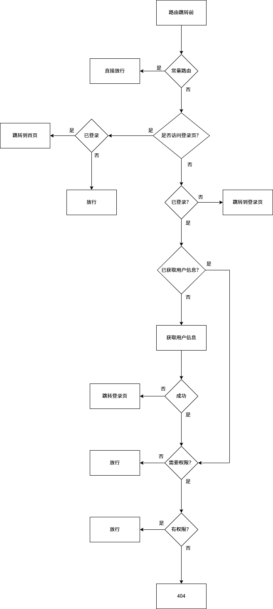

# 路由系统

## 路由过度效果

如果默认的路由动画不好看，你可以在`src/layouts/components/AppRouterView.vue`里修改。

:::danger 注意
虽然 vue3 已经支持了多个根组件，但是在启用了路由过度动画后，**路由组件**不能使用多个根组件，否则页面切换的时候白屏，即使是文本、注释也不可以, 也就是说`template`的第一个子元素必须是有效的 html 元素、组件。
:::

正确示例：

```vue
<template>
  <div></div>
</template>
```

错误示例：

存在多个根标签：

```vue
<template>
  <div></div>
  // [!code error]
  <div></div>
</template>
```

注释也不行：

```vue
<template>
  <div></div>
  // [!code error]
  <!-- 我是注释 -->
</template>
```

## 自动生成路由

`rengar-admin`的路由是基于`src/views`目录自动生成路由文件，无需手动配置， 自动生成的路由文件在`src/router/routes.ts`中，自动生成的路由的`name`类型文件位于`typings/common/vite-plugin-routes.d.ts`中。

::: tip 提示
在生成的路由文件中，手动修改 meta 的配置、`redirect`配置不会被自动覆盖，其他的均会被自动覆盖。
:::

### 生成规则

1. 路由的`path`根据文件夹来命名。
2. 叶子节点必须存在`index.vue`或者`[xxx].vue`的文件，否则会被忽略，不会生成路由。
3. 路由的`name`为祖先的目录命名，以`-`连接。
4. 路由的`meta`的`title`为祖先的目录命名，以`_`连接。
5. 以`[xxx].vue`的文件，会被认为是动态路由，生成路由时，会自动生成`params`参数，如`[id].vue`会生成`/:id`

::: danger 注意
`src/views`的 `404`、`home` 、`login`文件目录不能删除，其他的目录可以删除。
:::

### 单层路由

假设`src/views`目录下有如下目录结构：

```bash
src
└── views
    ├── dashboard
    │   └── index.vue


```

则会自动生成如下路由：

```ts
[
  {
    path: "/dashboard",
    name: "dashboard",
    meta: {
      title: 'dashboard'
    }
    component: () => import("@/views/dashboard/index.vue"),
  }
];
```

### 多级路由

假设`src/views`目录下有如下目录结构：

```bash
src
└── views
    ├── dashboard
    │   ├── index.vue
    │   └── analysis
    │       └── index.vue
    ├── user
    │   └── list
    │       └── index.vue
    │   └── add
    │       └── [index].vue
    │   └── edit
    │       └── [id].vue   # 动态路由

```

则会自动生成如下路由：

```ts
[
  {
    path: "/dashboard",
    name: "dashboard",
    meta: {
      title: 'dashboard'
    }
    component: () => import("@/views/dashboard/index.vue"),
    children: [
      {
        path: "/dashboard/analysis",
        name: "dashboard-analysis",
        meta: {
          title: 'dashboard_analysis'
        }
        component: () => import("@/views/dashboard/analysis/index.vue"),
      }
    ]
  },
  {
    path: "/user",
    name: "user",
    meta: {
      title: 'user'
    }
    children: [
      {
        path: "list",
        name: "user-list",
        meta: {
          title: 'user_list'
        }
        component: () => import("@/views/user/list/index.vue"),
      },
      {
        path: "add",
        name: "user-add",
        meta: {
          title: 'user_add'
        }
        component: () => import("@/views/user/add/index.vue"),
      },
      {
        path: "edit/:id",  # 动态路由
        name: "user-edit",
        meta: {
          title: 'user_edit'
        },
        component: () => import("@/views/user/edit/[id].vue"),
      }
    ]
  }
]
```

## meta 配置

| 属性        | 类型               | 默认值   | 说明                                                                |
| ----------- | ------------------ | -------- | ------------------------------------------------------------------- |
| title       | string             | 自动生成 | 路由的标题，会被用于生成面包屑和菜单的名称                          |
| layout      | "base"或"blank"    | base     | 页面的布局，默认为 base                                             |
| roles       | string 或 string[] | -        | 权限设置                                                            |
| icon        | string             | -        | 菜单的图标，直接使用"iconify"的图标名                               |
| localIcon   | string             | -        | 菜单的本地图标                                                      |
| keepAlive   | boolean            | -        | 页面是否缓存                                                        |
| hideInMenu  | boolean            | -        | 是否在菜单中隐藏                                                    |
| hideInTab   | boolean            | -        | 是否在 tab 栏中隐藏                                                 |
| activeMenu  | string             | -        | 当此页面被激活时，高亮显示的菜单的 name                             |
| constant    | boolean            | -        | 是否是常量路由，设置了该选项后，不需要登录、不需要鉴权就能访问      |
| order       | number             | -        | 排序                                                                |
| href        | string             | -        | 设置了会外部跳转该链接                                              |
| fixedInTab  | boolean            | -        | 是否固定在 tab 栏中                                                 |
| showBack    | boolean            | -        | 是否显示返回按钮，若为 true 则在 tab 栏左侧显示，tab 隐藏该选项无效 |
| multipleTab | boolean            | -        | 同一个 name 的路由是否多开，适用于详情之类的页面                    |

## keep-alive

得益于[vue-router](https://router.vuejs.org/zh/guide/essentials/nested-routes.html#%E5%BF%BD%E7%95%A5%E7%88%B6%E7%BB%84%E4%BB%B6-)的新特性，实现多级`keep-alive`非常简单，
要想实现页面`kee-alive`缓存，需要做如下配置：

1. 路由的`meta`中设置`keepAlive: true`
2. 当前路由的祖先路由中不允许出现`component`字段。

如：

```ts
{
    path: "/user",
    name: "user",
    meta: {
      title: 'user'
    }， # 这里没有component字段
    children: [
      {
        path: "list",
        name: "user-list",
        meta: {
          title: 'user_list',
          keepAlive: true
        }
        component: () => import("@/views/user/list/index.vue"),
      },
    ]
  }
```

原理： `rengar-admin`会在构建的时候会在`.vue`文件自动注入`defineOptions({name: 'xxx'})`，`xxx`为当前路由的`name`。也就是说，在开发中手动设置路由组件的`name`是无效的。该自动注入插件位于`packages/vite-plugin-vue-inject-name`中。

## 路由跳转

为了路由跳转能获得类型提示，`rengar-admin`封装了自定义 hooks，位于`src/hooks/router.ts`中。

## 一个基本的路由示例

常见的列表、新增、编辑的示例。

目录结构：

```bash
src
└── views
    ├── user
    │   └── list
    │       └── index.vue
    │   └── add
    │       └── index.vue
    │   └── edit
    │       └── [id].vue
```

路由：

```ts
[
  {
    path: "/user",
    name: "user",
    meta: {
      title: '用户管理'
    },
    redirect: '/user/list',
    children: [
      {
        path: "list",
        name: "user-list",
        meta: {
          title: '用户列表',
          hideInMenu: true,
          activeMenu: 'user'
        }
        component: () => import("@/views/user/list/index.vue"),
      },
      {
        path: "add",
        name: "user-add",
        meta: {
          title: '新增用户',
          hideInMenu: true,
          activeMenu: 'user'
        }
        component: () => import("@/views/user/add/index.vue"),
      },
      {
        path: "edit/:id",  # 动态路由
        name: "user-edit",
        meta: {
          title: '编辑用户',
          hideInMenu: true,
          activeMenu: 'user'
        },
        component: () => import("@/views/user/edit/[id].vue"),
      }
    ]
  }
]
```

## 全局路由守卫流程图

全局路由守卫代码位于`src/router/guard.ts`中。



## 去除自动生成路由

如果不需要自动生成路由，在`build/plugins/index.ts`移除路由插件：

```ts
export function setupVitePlugins() {
  const plugins: PluginOption[] = [
    setupInject(),
    vue(),
    vueJsx(),
    vueDevTools(),
    setupRouter(), // [!code --]
    setupUnocssPlugin(),
    ...setupAutoImportPlugin(),
    setupVersion(),
  ];
  return plugins;
}
```

就可以去`src/router/routes.ts`中手动配置路由了。

:::danger 注意
如果你去除了路由插件，如果要继续使用 keep-alive 功能，那么你的路由配置中的 name 必须遵循与插件自动生成的规则一致（即：路由的 name 为祖先的目录命名，以-连接）。
:::
